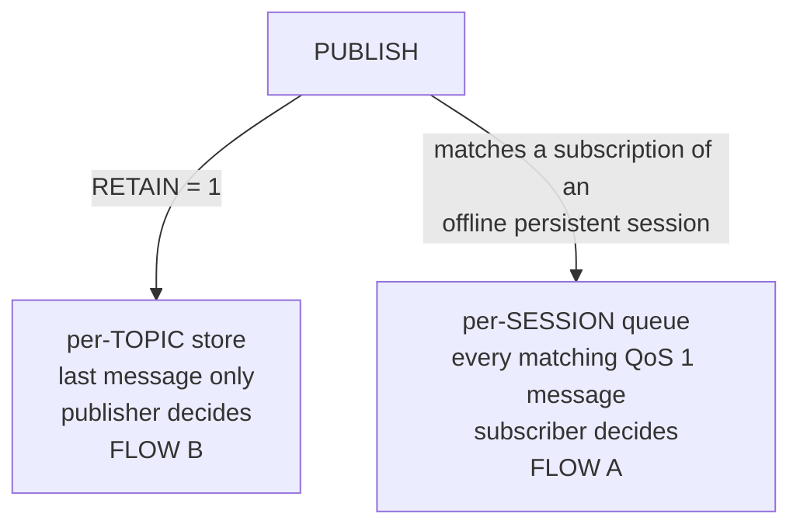
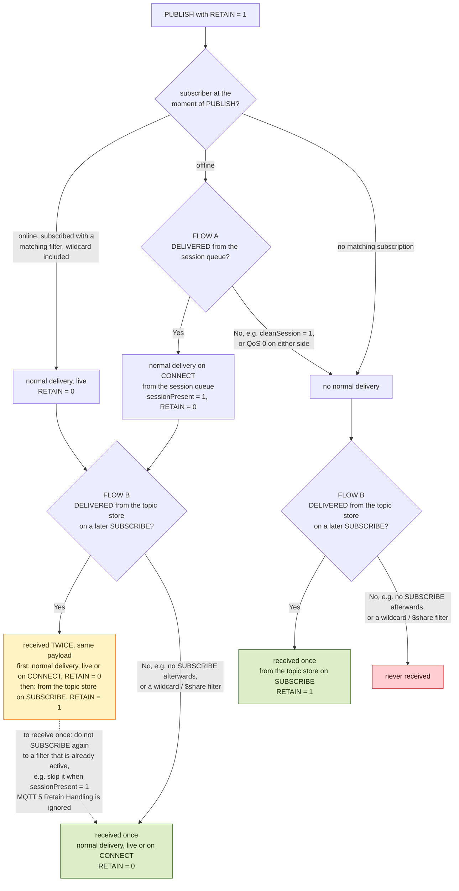
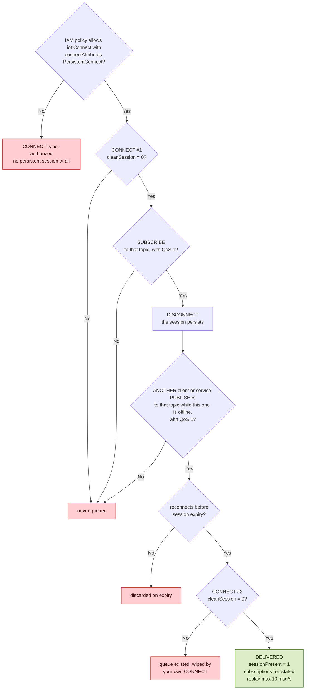
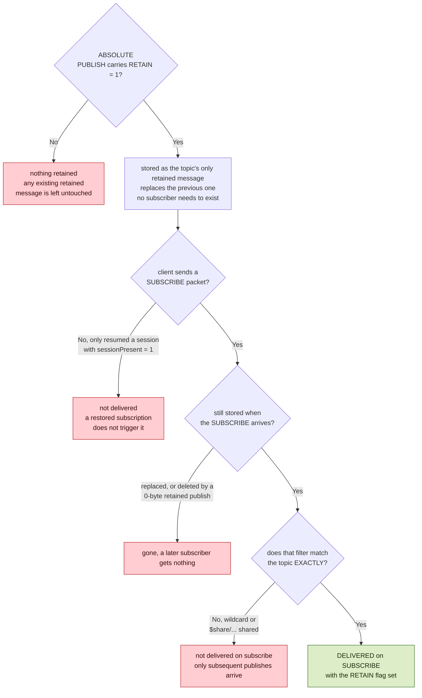
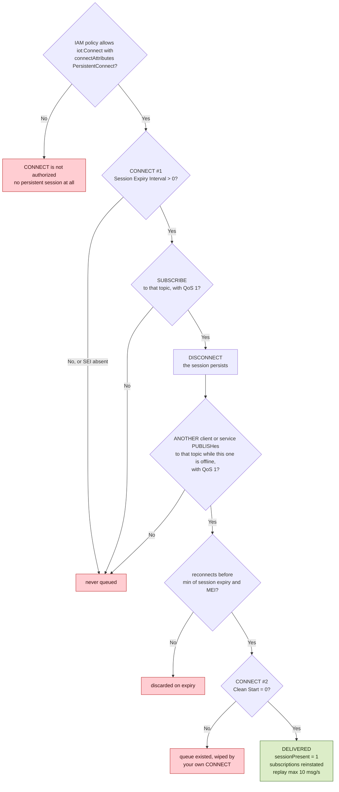
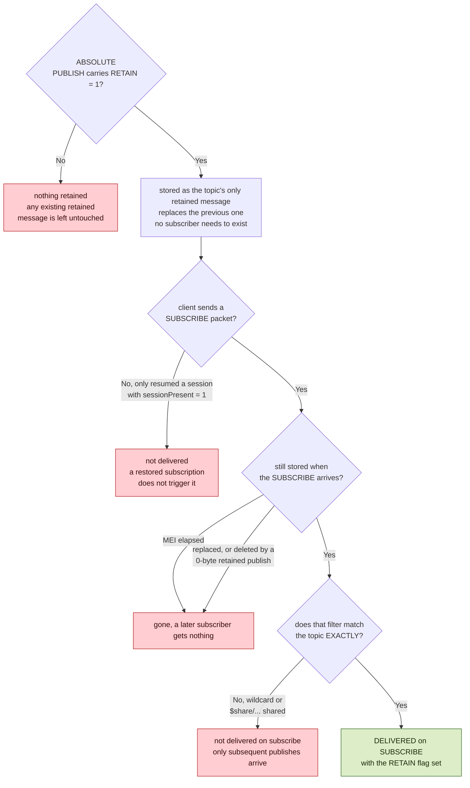

# Session, queuing and retain: decision flows

One PUBLISH can enter two independent stores. That split is the only thing the two MQTT versions share here.



## FLOW A + B - how many times is a retained PUBLISH received ?



# MQTT 3.1.1

## FLOW A - does a device get what it missed while offline?



```
persistent connect   authorization, not just the flag: the default policy is a
                     non-persistent connection that passes no attributes, so the policy
                     must permit PersistentConnect through the iot:ConnectAttributes
                     condition key on iot:Connect. That the CONNECT is refused without it
                     follows from the condition-key mechanics; the docs state only the
                     requirement
```

cleanSession is one flag doing both jobs, so the CONNECT #1 and CONNECT #2 checks can never disagree in a client that always sends the same value.

## DEADLINE - how long the queue survives the disconnect

v3.1.1 has no expiry concept at all: the OASIS specification defines neither message nor session expiry. Nothing starts at publish time.

```
subscriber   CONNECT #1     SUBSCRIBE         DISCONNECT
             |              |                 |
             |              |                 |<------------------- session expiry -------------------->|
                                                                                                        ^
                                                                                            the only deadline
publisher                                                   PUBLISH
                                                            |   no timer starts here
```

```
session expiry   a client cannot set it in this version. It is the account quota
                 "Persistent session expiry period", 3600 s by default, applied to every
                 session in the account and changed only by an account limit increase.
                 Approximate: runs up to 30 min long, never short
```

## FLOW B - does a client that subscribes later get the last value?



```
who can receive   any client, including cleanSession = 1 and QoS 0 subscriptions.
                  No session is involved, so it must re-SUBSCRIBE after each reconnect
not allowed       reserved topics cannot be published with RETAIN set
inspect           ListRetainedMessages / GetRetainedMessage.
                  The session queue has no equivalent read API
```

# MQTT 5

## FLOW A - does a device get what it missed while offline?



```
persistent connect   authorization, not just the flag: the default policy is a
                     non-persistent connection that passes no attributes, so the policy
                     must permit PersistentConnect through the iot:ConnectAttributes
                     condition key on iot:Connect. That the CONNECT is refused without it
                     follows from the condition-key mechanics; the docs state only the
                     requirement
```

Clean Start and SEI are separate flags, which is why the two CONNECT checks are independent here: Clean Start = 1 on the first CONNECT does not stop SEI > 0 from holding, yet Clean Start = 1 on the reconnect destroys the queue.

```
Clean Start   ends the PREVIOUS session       -> matters only at the reconnect
SEI           ends the CONNECTING session     -> matters at the first CONNECT,
                                                 and sets the deadline
SEI on DISCONNECT   current SEI = 0   -> cannot be raised above 0
                    current SEI > 0   -> setting 0 ends the session at that DISCONNECT
                    otherwise         -> updates the current session's SEI
```

## DEADLINE - how long the queue survives, the earlier of two timers

```
subscriber   CONNECT #1     SUBSCRIBE         DISCONNECT
             |              |                 |
             |              |                 |<------------------- session expiry -------------------->|
publisher                                                   PUBLISH
                                                            |
                                                            |<---------- MEI ---------->|
                                                                                        ^
                                                                       deadline = whichever elapses first
```

```
session expiry   the client sets it per session through SEI, and it is clamped to
                 the same account quota "Persistent session expiry period" as MQTT 3,
                 3600 s by default with up to 7 days supported. The clamped value comes
                 back in the CONNACK. Approximate: runs up to 30 min long, never short
MEI              v5 only, PUBLISH property, v5 spec 3.3.2.3.3. min 1 s, a client-sent 0
                 is adjusted to 1, max 604800 s and higher values are clamped. Absent
                 means never expires. Only shortens retention, never extends it past
                 session expiry. Outbound the subscriber sees the remaining interval,
                 and 999 ms or less reads as 0
```

## FLOW B - does a client that subscribes later get the last value?



```
who can receive   any client, including Clean Start = 1 and QoS 0 subscriptions.
                  No session is involved, so it must re-SUBSCRIBE after each reconnect
not allowed       reserved topics cannot be published with RETAIN set
inspect           ListRetainedMessages / GetRetainedMessage.
                  The session queue has no equivalent read API
```

# Cross-version

```
sessions   never resumable across versions: an MQTT 3 session cannot be resumed as
           MQTT 5, or vice versa, whatever the flags
MEI        decided by the MQTT version of the INBOUND publish, not the subscriber's.
           An MQTT 5 publisher's MEI can expire a message queued for an MQTT 3
           subscriber. MQTT 3 cannot set an MEI but can lose a message to one
```

Sources: [MQTT](https://docs.aws.amazon.com/iot/latest/developerguide/mqtt.html) and [AWS IoT Core quotas](https://docs.aws.amazon.com/general/latest/gr/iot-core.html) in the AWS IoT Core developer guide, plus the OASIS [MQTT v3.1.1](https://docs.oasis-open.org/mqtt/mqtt/v3.1.1/os/mqtt-v3.1.1-os.html) and [MQTT v5.0](https://docs.oasis-open.org/mqtt/mqtt/v5.0/os/mqtt-v5.0-os.html) specifications.
